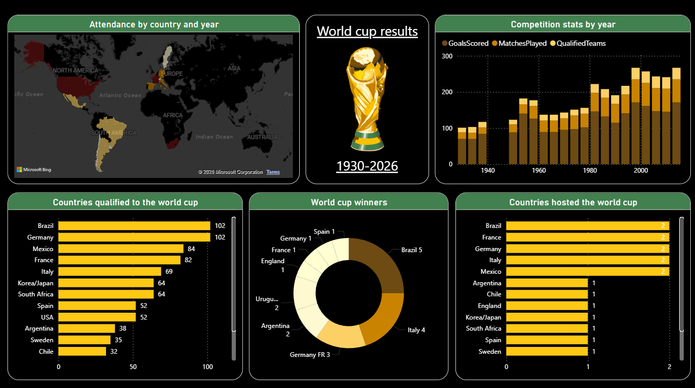

# FIFA World Cup Dashboard - Power BI

## Overview
This Power BI dashboard analyzes FIFA World Cup statistics from 1930 to 2026.

## Features
- Attendance by country and year
- Competition stats by year
- Countries qualified to the World Cup
- World Cup winners analysis
- Countries hosted the World Cup

## Tools Used
- Power BI Desktop
- DAX
- Excel / CSV

## Dashboard Preview

## Files Included
- FIFA_World_Cup_Dashboard.pbix
- WorldCupPlayers.csv
- WorldCups.csv
- WorldCupMatches.csv

## Key Insights
- Brazil has won the most FIFA World Cups
- Germany and Brazil qualified the most times
- Total goals scored increased over the years
- Several countries hosted the tournament multiple times